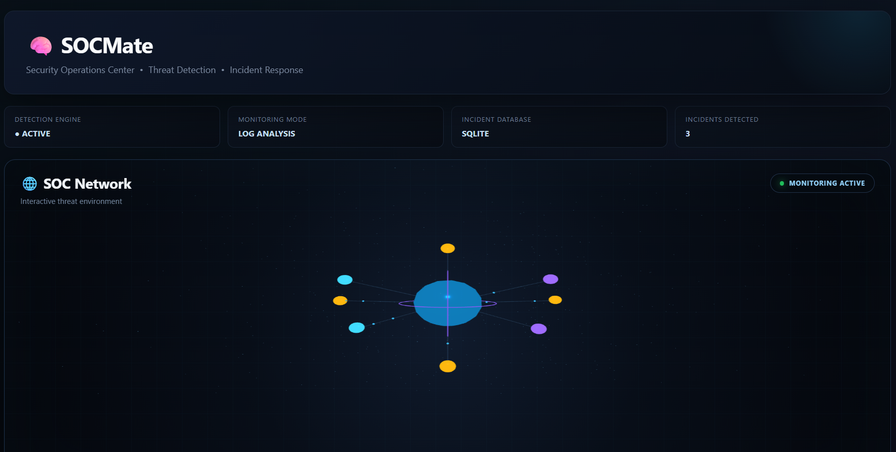
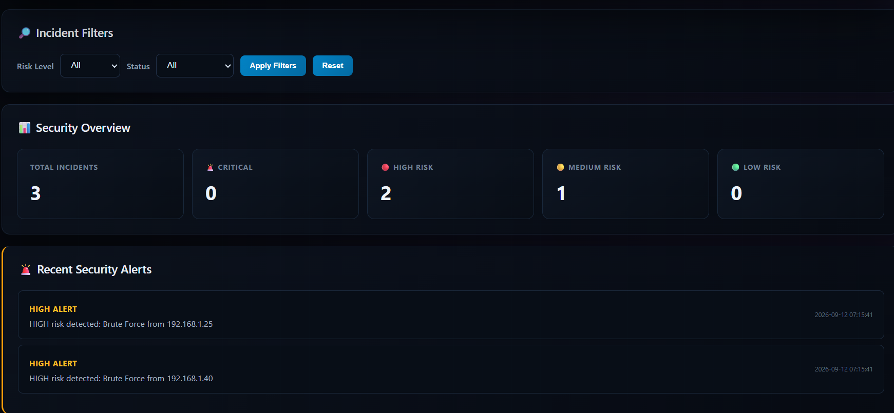
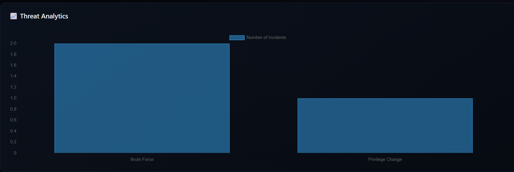
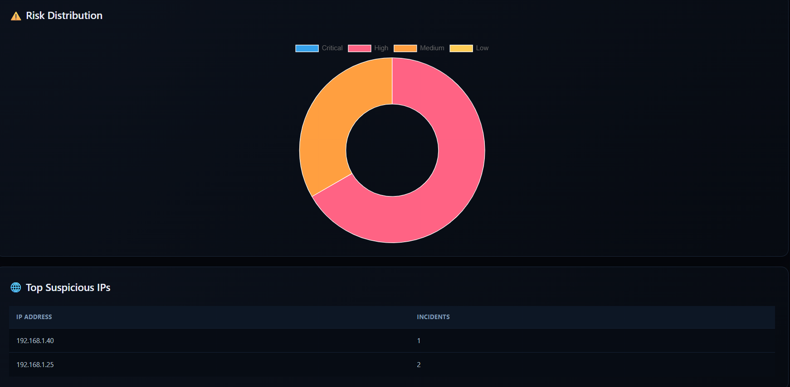
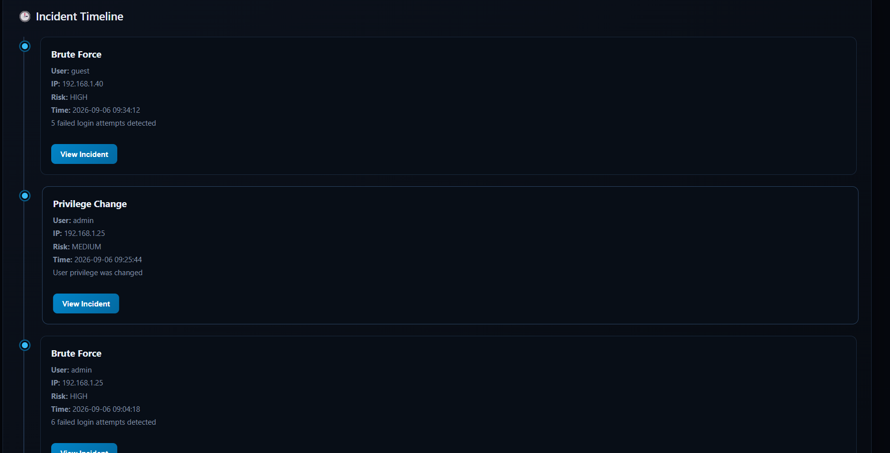
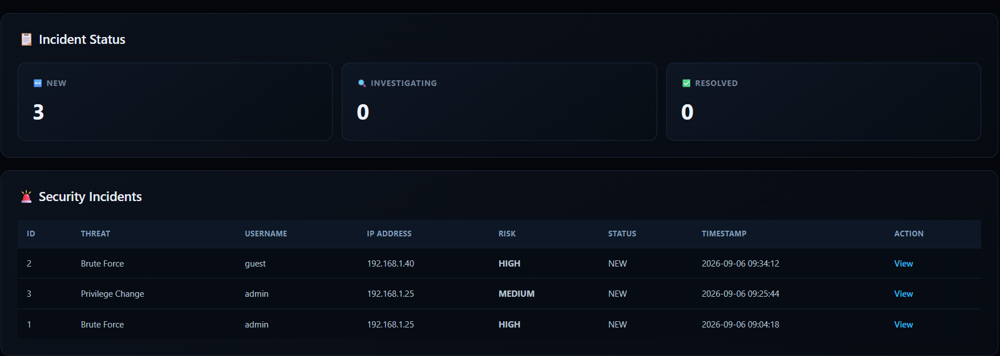

# 🧠 SOCMate

### Python-Based Mini Security Operations Center for Threat Detection and Incident Monitoring

SOCMate is a Python-based cybersecurity project that simulates the basic workflow of a Security Operations Center (SOC).

It analyzes security logs, detects suspicious activity using rule-based detection, calculates risk levels, generates security alerts, stores incidents in SQLite, and presents the results through an interactive Flask dashboard.

> **Note:** SOCMate uses synthetic/sample security logs for educational and demonstration purposes. It is designed to demonstrate basic SOC monitoring and threat-detection concepts.

---

## 🎯 Problem Statement

Security Operations Centers continuously monitor logs and security events to identify suspicious activity and potential threats.

Analyzing large numbers of security events manually can make it difficult to quickly identify important incidents.

SOCMate addresses this problem by automatically analyzing security logs and identifying suspicious patterns such as repeated failed logins, privilege changes, and authentication activity involving multiple usernames.

The detected activity is converted into security incidents with risk levels and alerts, allowing analysts to investigate important events through a centralized dashboard.

---

## 💡 Solution

SOCMate provides a simplified SOC workflow that automatically processes security logs.

The system:

1. Loads security logs from a CSV file
2. Parses and processes the log data
3. Applies rule-based threat detection
4. Identifies suspicious security events
5. Calculates a numerical risk score
6. Classifies incidents by risk level
7. Stores incidents in an SQLite database
8. Generates security alerts
9. Displays security information through a Flask dashboard
10. Allows analysts to investigate and update incident status

This demonstrates the basic workflow used in security monitoring and incident management systems.

---

## ✨ Features

- 🔍 Security log analysis using Python and Pandas
- 🚨 Brute-force login detection
- 🔐 Suspicious login detection
- 👥 Multi-user attack detection
- ⚠️ Privilege change detection
- 🔑 Successful login after repeated failures detection
- 📊 Risk score calculation
- 🚦 LOW / MEDIUM / HIGH / CRITICAL risk classification
- 🚨 Automated security alerts
- 🗄️ SQLite-based incident database
- 🔎 Incident investigation page
- 🔄 Incident status workflow
- 📈 Threat analytics
- 📊 Risk distribution visualization
- 🌐 Interactive Flask SOC dashboard
- 🌐 3D SOC network visualization
- 🧪 Automated testing using Pytest

---

## 🏗️ Project Architecture

```text
                         Security Logs
                              │
                              ▼
                         Log Parser
                              │
                              ▼
                      Threat Detection
                              │
                 ┌────────────┴────────────┐
                 │                         │
                 ▼                         ▼
          Detection Rules            Security Events
                 │                         │
                 └────────────┬────────────┘
                              ▼
                         Risk Scoring
                              │
                              ▼
                      Risk Classification
                              │
                    ┌─────────┴─────────┐
                    │                   │
                    ▼                   ▼
             SQLite Database      Security Alerts
                    │
                    ▼
             Flask SOC Dashboard
                    │
          ┌─────────┼──────────┐
          │         │          │
          ▼         ▼          ▼
       Analytics  Timeline  Investigation
                              │
                              ▼
                       Status Management
```

---

## 🔍 Threat Detection

SOCMate uses rule-based detection techniques to identify suspicious activity in security logs.

### 🚨 Brute Force Detection

Detects repeated failed login attempts from the same username and IP address.

The current detection threshold is:

```text
5 or more failed login attempts
→ Brute Force
```

Example:

```text
admin → 192.168.1.25
6 failed login attempts
        ↓
Brute Force detected
        ↓
HIGH risk
```

---

### 🔐 Suspicious Login Detection

Identifies repeated failed login attempts that do not reach the brute-force threshold.

The current rule detects:

```text
3–4 failed login attempts
→ Suspicious Login
```

---

### 👥 Multi-User Attack Detection

Detects an IP address attempting authentication against multiple usernames.

This can indicate suspicious authentication activity involving several accounts.

Example:

```text
192.168.1.50
     │
     ├── user1
     ├── user2
     └── user3
          ↓
Multi-User Attack
```

---

### ⚠️ Privilege Change Detection

Detects privilege-change events in the security logs.

Privilege changes can be important security events because they may affect the permissions available to an account.

SOCMate flags these events for investigation.

---

### 🔑 Successful Login After Failures

Detects a successful login occurring after multiple failed authentication attempts.

Example:

```text
FAILED
FAILED
FAILED
FAILED
   ↓
SUCCESS
   ↓
Suspicious authentication pattern
```

---

## 📊 Risk Scoring

SOCMate assigns a numerical risk score based on the detected threat type.

| Threat | Score |
|---|---:|
| Suspicious Login | 4 |
| Privilege Change | 5 |
| Brute Force | 7 |
| Multi-User Attack | 8 |
| Successful Login After Failures | 8 |

### Risk Classification

```text
0–2   → LOW
3–5   → MEDIUM
6–8   → HIGH
9+    → CRITICAL
```

Example:

```text
Brute Force
     ↓
Risk Score: 7
     ↓
Risk Level: HIGH
     ↓
Security Alert Generated
```

---

## 🚨 Security Alerts

SOCMate generates alerts based on the calculated risk level.

Example alert levels:

```text
🟢 LOW
No immediate action required.

🟡 MEDIUM
Investigation recommended.

⚠️ HIGH
Suspicious activity detected.

🚨 CRITICAL
Immediate investigation required.
```

HIGH and CRITICAL incidents are also stored in the alerts database table.

---

## 🗄️ Incident Management

SOCMate stores detected incidents using SQLite.

Each incident can contain information such as:

- Incident ID
- Threat type
- Username
- IP address
- Severity
- Risk score
- Risk level
- Timestamp
- Description
- Incident status

### Incident Status Workflow

```text
NEW
 │
 ▼
INVESTIGATING
 │
 ▼
RESOLVED
```

This simulates a basic incident-management workflow used by security teams.

---

## 📊 Dashboard

SOCMate provides an interactive Flask-based SOC dashboard.

The dashboard includes:

- Total incident count
- HIGH risk incidents
- MEDIUM risk incidents
- LOW risk incidents
- CRITICAL risk incidents
- Threat analytics
- Risk distribution
- Suspicious IP analysis
- Incident timeline
- Security alerts
- Incident status
- Incident investigation
- Interactive 3D SOC network

---

## 🌐 3D SOC Network

SOCMate includes an interactive 3D visualization representing a simplified SOC environment.

The visualization contains:

```text
                SOC CORE
                   │
       ┌───────────┼───────────┐
       │           │           │
       ▼           ▼           ▼
     Users       Servers     Threats
       │           │           │
       └───────────┼───────────┘
                   │
             Security Data
```

The visualization helps provide a visual representation of security monitoring and communication between different SOC components.

---

## 📁 Project Structure

```text
SOCMate/
│
├── data/
│   └── sample_logs.csv
│
├── screenshots/
│   ├── 01_dashboard.png
│   ├── 02_soc_network.png
│   ├── 03_threat_analytics.png
│   ├── 04_risk_distribution.png
│   ├── 05_incident_timeline.png
│   └── 06_incident_investigation.png
│
├── src/
│   ├── __init__.py
│   ├── main.py
│   ├── parser.py
│   ├── detector.py
│   ├── scoring.py
│   ├── database.py
│   └── check_database.py
│
├── tests/
│   └── test_socmate.py
│
├── web/
│   ├── app.py
│   ├── static/
│   │   └── style.css
│   └── templates/
│       ├── index.html
│       └── incident.html
│
├── .gitignore
├── pytest.ini
├── requirements.txt
└── README.md
```

---

## ⚙️ Technologies Used

- **Python** — Core application and threat detection
- **Pandas** — Security log processing
- **Flask** — Web dashboard
- **SQLite** — Incident and alert storage
- **HTML/CSS** — Dashboard interface
- **JavaScript** — Interactive dashboard functionality
- **Chart.js** — Security analytics charts
- **Three.js** — 3D SOC network visualization
- **Pytest** — Automated testing
- **Git & GitHub** — Version control and project hosting

---

## 🚀 Installation

### 1. Clone the repository

```bash
git clone https://github.com/snehadalwe/SOCMate.git
cd SOCMate
```

---

### 2. Create a virtual environment

Windows:

```bash
python -m venv venv
```

---

### 3. Activate the virtual environment

Windows PowerShell:

```powershell
.\venv\Scripts\Activate.ps1
```

---

### 4. Install dependencies

```bash
pip install -r requirements.txt
```

---

## ▶️ Running SOCMate

### Run the security analysis

From the project root:

```bash
python src/main.py
```

The application will:

- Load the sample security logs
- Detect security incidents
- Calculate risk scores
- Generate alerts
- Store incidents in SQLite

---

## 🌐 Running the Web Dashboard

Start the Flask application:

```bash
python web/app.py
```

Then open the local address shown by Flask:

```text
http://127.0.0.1:5000
```

The dashboard provides an overview of detected security incidents and allows individual incidents to be investigated.

---

## 🧪 Running Tests

Run the automated test suite:

```bash
pytest
```

Current test result:

```text
6 passed
```

The tests validate core SOCMate functionality including threat detection and risk scoring.

---

## 🔐 Security Approach

SOCMate uses **rule-based security detection** rather than executing or interacting with potentially malicious content.

The system analyzes structured security logs and looks for predefined suspicious patterns.

This project demonstrates cybersecurity concepts such as:

- Security log analysis
- Threat indicators
- Authentication monitoring
- Rule-based detection
- Risk scoring
- Security alerts
- Incident management
- Security visualization
- Defensive security monitoring

---

## 📸 Screenshots

### 🧠 SOCMate Security Dashboard



---

### 🌐 Interactive SOC Network



---

### 📊 Threat Analytics



---

### 📈 Risk Distribution



---

### 🚨 Incident Timeline



---

### 🔎 Incident Investigation



---

## 🔮 Future Improvements

Possible future enhancements include:

- Real-time log monitoring
- Log ingestion from multiple sources
- Email and notification integration
- Advanced detection rules
- Machine-learning-based anomaly detection
- Threat-intelligence integration
- IP reputation analysis
- Role-based access control
- Authentication and user accounts
- Advanced incident correlation
- Cloud deployment
- SIEM integration

---

## 🎓 Learning Outcomes

Building SOCMate provided practical experience with:

- Python programming
- Pandas-based data processing
- Security log analysis
- Rule-based threat detection
- Risk assessment
- Security alert generation
- Incident management
- SQLite database integration
- Flask web development
- JavaScript visualization
- SOC dashboard design
- Automated testing
- Git and GitHub
- Basic SOC/SIEM workflows

---

## ⚠️ Disclaimer

SOCMate is an educational cybersecurity project that uses synthetic/sample security logs for demonstration and testing.

It is intended for learning and authorized defensive-security use.

The detection rules are simplified and should not be considered a replacement for professional SOC, SIEM, threat-intelligence, or incident-response systems.

---

## 👩‍💻 Author

**Snehal Dalwe**

BTech CSE — Cybersecurity

GitHub: https://github.com/snehadalwe

---

## ⭐ Project Goal

SOCMate demonstrates how Python, data processing, rule-based threat detection, databases, web development, visualization, and automated testing can be combined to create a practical cybersecurity monitoring application.

The project was built to gain hands-on experience with the basic workflow of a **Security Operations Center** and strengthen practical skills in **Python and Cybersecurity**.